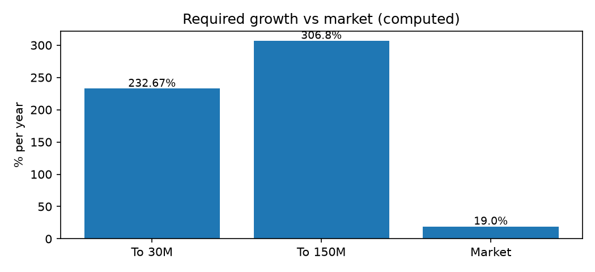
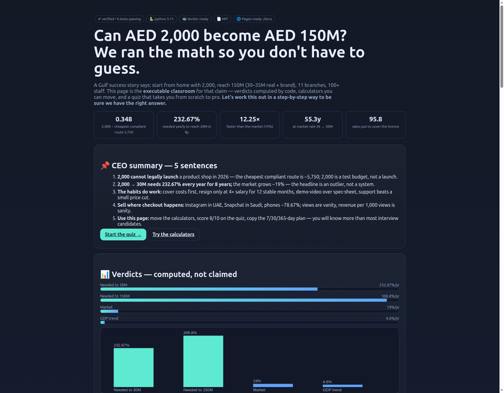

# From AED 2,000 to AED 150M in Gulf E-commerce: A Falsifiable, Executable Verification Study (2017–2026)


> **Live interactive site — click one (all three work):**
> - 🌐 [`https://m0-ar.github.io/aed2000-to-150m-replication-study/`](https://m0-ar.github.io/aed2000-to-150m-replication-study/) — homepage (works when Pages source is `/docs` **or** `/`)
> - 🌐 [`https://m0-ar.github.io/aed2000-to-150m-replication-study/preview.html`](https://m0-ar.github.io/aed2000-to-150m-replication-study/preview.html) — direct page (works when Pages source is `/docs`)
> - 🌐 [`https://m0-ar.github.io/aed2000-to-150m-replication-study/docs/preview.html`](https://m0-ar.github.io/aed2000-to-150m-replication-study/docs/preview.html) — mirrored path (works when Pages source is `/`)
> - 📁 Local: open [`docs/preview.html`](docs/preview.html) in your browser.
> - ⚙️ Setup: **Settings → Pages → Deploy from a branch → `main` → `/docs` (recommended)**. Mirrors make the other setting work too.

## CEO summary — the whole story in 30 seconds

1. A famous Gulf podcast claims **AED 2,000 turned into AED 150M** starting from home in 2017.
2. We tested every important sentence of that story against **real 2026 public market numbers** — market size, licence costs, failure rates, and live economic data — with code you can re-run in one command.
3. Result: **AED 2,000 cannot legally launch a product shop in 2026** (cheapest compliant route is ~AED 5,750); **2,000 → 30M needs 232.7% growth every year for 8 years** (market grows ~19%), so the headline is an extraordinary outlier, not a repeatable system.
4. The good news: **the habits inside the story do work** — cover costs first, quit your job only at 4× salary for 12 stable months, demo-video over spec-sheet, support-as-moat, Instagram for checkout in UAE / Snapchat in Saudi, offline only where online orders already cluster, organic first.
5. Use this repo as **calculator + checklist + classroom**: run 7 commands, get verdicts, copy the 7-day / 30-day / 12-month plan, and pass the quiz in the live site — you will know more than most interview candidates.


*Figure 1 — Machine-generated verdicts. Every bar is computed, not drawn by hand. Re-run to refresh.*

---

## ✨ Demo — see it working in 60 seconds

| Way | Link / command |
|-----|----------------|
| 🌐 **Interactive website** (best) | Local [`docs/preview.html`](docs/preview.html) · Live [`/` matches source `/docs` or `/`](https://m0-ar.github.io/aed2000-to-150m-replication-study/) · [`/preview.html`](https://m0-ar.github.io/aed2000-to-150m-replication-study/preview.html) · [`/docs/preview.html`](https://m0-ar.github.io/aed2000-to-150m-replication-study/docs/preview.html). Charts, calculators, quiz. |
| 🖼️ **Screenshots** | [`docs/assets/preview-top.png`](docs/assets/preview-top.png) · [`docs/assets/preview-quiz.png`](docs/assets/preview-quiz.png) — auto-captured with a real browser (see § Reproducibility). |
| 🎬 **Video demo** | Play [`docs/assets/demo.html`](docs/assets/demo.html) — a self-playing walkthrough (works on GitHub Pages; GitHub READMEs show videos via a clickable thumbnail, see below). Press play, it types the commands for you. |
| ⚡ **Terminal** | `python -m src.run_all` prints 7 verdicts in ~1 second. |

Clickable video thumbnail pattern (GitHub strips `<video>` in READMEs, so we link a thumbnail → playable page):

[](docs/assets/demo.html)

> **Why this matters:** you do not have to trust our words. Press play, run one command, and the numbers appear on your machine.

---

## 🚀 Features — what this repo actually does

- **12 claims → 7 executable experiments (EXP01–EXP07):** licence floor, compounding math, 4× resignation rule, 7-day profit myth, category 80% test, channel split, unit economics.
- **Frozen public snapshots + live re-check:** `data/snapshots/market_2026.json` holds every market number with source + date; `src/fetch_live.py` re-pulls live macro data.
- **One-command verdicts:** `python -m src.run_all` writes `report.json` + `benchmarks/results.md`. No spreadsheets, no manual math.
- **Quality gate:** `pytest -q` — 6 tests must pass before any conclusion counts.
- **Interactive learning site:** `docs/preview.html` — charts, break-even calculator, 10-question quiz from scratch to pro with step-by-step explanations.
- **Docker + Pages ready:** `docker compose up --build verify` reproduces everything; `/docs` folder + `.nojekyll` + workflow deploys the site automatically.
- **Replication protocol:** honest 7-day test (≤AED 2,000), 30-day compliant launch, 12-month scale plan with pre-registered kill rules.
- **8 hidden patterns:** licence-floor paradox, valuation-mirage ratio, shock-dependence, support-as-moat, demo-over-spec, view-to-cash asymmetry, close-to-move, AI hours-saved.

---

## 👥 Who is this for — user stories

- **🎓 Student / job seeker:** read the 🌱 Beginner guide (15 min), pass the quiz, then answer any interview question about unit economics, CAC, CAGR, or Gulf e-commerce with real numbers.
- **🛍️ First-time founder (UAE / Saudi):** copy the 7-day test + 30-day launch checklist, price your licence + gateway + 3PL before you spend on ads, avoid the 80–90% first-year trap.
- **💼 Investor / analyst:** use the valuation-mirage check (77–80% intangible at 150M/30–35M) and 4×-salary diligence before you believe a market-value slide.
- **👩‍🏫 Teacher / mentor:** assign the live site + quiz as homework; every answer links back to the experiment that proves it.
- **🔬 Researcher:** fork the snapshot + harness, add 3 SKUs of your own, submit a pull request with dated sources + passing tests — that is a publishable extension.

---

## 🌱 Beginner guide — read this and you are a professional

> You will know more than most interview candidates after this section. Let's work this out in a step-by-step way to be sure we have the right answer.

**Step 0 — The one idea.** A business lives or dies on three numbers: how much to start (capital), how fast it must grow (CAGR), and how many sales to survive (break-even). Everything else is commentary.

**Step 1 — How much to start?** In 2026 the cheapest compliant product route costs ~AED 5,750 (licence alone). AED 2,000 ÷ 5,750 = **0.348** — less than half. So AED 2,000 is a *test budget* (friends try the product, 3 videos, AED 200–300 ads), not a launch budget. *Experiment: EXP01 + EXP07.*

**Step 2 — How fast to reach millions?** Growth compounds: `end = start × (1 + rate)^years`. Flip it: `rate = (end/start)^(1/years) − 1`. Plug 2,000 → 30,000,000 in 8 years: `(15,000)^(1/8) − 1 = 232.67%` per year. Market grows ~19%. Ratio: 232.67 ÷ 19 = **12.25× faster than the whole market**. At 19%, 2,000 → 30M takes **55.3 years**. That is why the headline is extraordinary. *Experiment: EXP02. Try it in the site calculator.*

**Step 3 — When to quit your job?** Only when monthly net = **4× salary for 12 stable months**. Example: 20k salary → 80k net = 20k pay yourself + 20k grow + 20k run + 20k buffer. Use the *worst* month, not the best. *Experiment: EXP03.*

**Step 4 — When to expect profit?** Not in 7 days. Typical runway is **18–24 months**; **80–90%** of low-budget shops fail in year one. Right order: cover costs → break-even → profit. *Experiment: EXP04.*

**Step 5 — What to sell, where?** Biggest online share is fashion; fastest growth is food — not gadgets market-wide. Gadgets win *only* with demo-video + fair price + warranty + support. UAE checkout wins on Instagram; Saudi wins on Snapchat; phones are ~78.67% of orders. Views ≠ cash: track revenue per 1,000 views. *Experiments: EXP05 + EXP06.*

**Step 6 — Your turn.** Open `docs/preview.html`, move the price slider, answer 10 quiz questions. Each answer shows its step-by-step math. Score ≥8/10 and you can explain this repo to anyone — including someone who has never sold anything online.

---

## ⚡ Quick start — 30 seconds to first verdict

```bash
pip install -r requirements.txt
python -m src.run_all        # 7 verdicts + report.json + benchmarks/results.md
pytest -q                    # 6 tests, must pass
python -m benchmarks.benchmark_suite
python -m src.fetch_live     # live macro re-check
```

```bash
docker compose up --build verify   # same, inside Docker
docker compose run --rm test
docker compose up docs             # http://localhost:8000 serves docs/preview.html
```

---

## 📑 Table of contents

- [CEO summary](#ceo-summary--the-whole-story-in-30-seconds)
- [Demo](#-demo--see-it-working-in-60-seconds)
- [Features](#-features--what-this-repo-actually-does)
- [Who is this for](#-who-is-this-for--user-stories)
- [Beginner guide](#-beginner-guide--read-this-and-you-are-a-professional)
- [Quick start](#-quick-start--30-seconds-to-first-verdict)
- [Verdict matrix](#1-verdict-matrix)
- [Claims C1–C12](#2-claims-under-test-c1c12)
- [How we verified](#3-how-we-verified-zero-to-hero-step-by-step)
- [Public anchors 2026–2027](#4-public-anchors-20262027)
- [Experiments EXP01–EXP07](#5-experiments-exp01exp07)
- [Hidden patterns P1–P8](#6-hidden-patterns-p1p8)
- [Replication protocol](#7-replication-protocol-7-day--30-day--12-month)
- [Reproducibility + GitHub Pages](#8-reproducibility--github-pages)
- [Screenshots + video](#9-screenshots--video-how-they-were-made)
- [FAQ](#10-faq)
- [Limitations + ethics](#11-limitations-threats-ethics)
- [References](#12-references)
- [Cite + publish next](#13-how-to-cite--publish-next)
- [License](#-license) · [Contributing](#-contributing)

---

## 1. Verdict matrix

| # | Claim | Public anchor | Verdict |
|---|-------|---------------|---------|
| C1 | 2,000 starts a business | Cheapest compliant route ~5,750; basic permit ~1,070 (nationals/services-only); fine ≤1M | **REFUTED-AS-STATED-2026** (test budget only) |
| C2 | 2,000→150M (30–35M real) | Market ~19% (2020–25) / ~9.9–11.3% (2026–31); needs 232.7% to 30M (306.8% to 150M) over 8y; 55.3y at market | **EXTRAORDINARY OUTLIER, not a system** |
| C3 | Resign at 4× salary net | 25/25/25/25 + 12-month stability | **SUPPORTED-CONDITIONAL** |
| C4 | No 7-day profit plan | Typical runway 18–24mo; 80–90% year-1 fail | **STORYTELLER CORRECT TO REJECT** |
| C5 | Gap vs copy+innovate | Find gaps; copy allowed only with added service/value | **SUPPORTED** |
| C6 | Emotion>specs; brand>national | Demo/color/hours beat spec tables; brand first in mixed markets | **SUPPORTED** |
| C7 | Home/robot/camera 80%+ | Fashion largest share 21.59%; food fastest 13.16% | **SELLER-SPECIFIC, NOT GENERAL** |
| C8 | IG/TT (UAE), Snap (KSA) | Phones 78.67%; local stacks (mada/Apple Pay/installments) | **SUPPORTED** |
| C9 | Offline ~50/50 viable | Mall expansion; tactile buyers; attach-selling | **PLAUSIBLE** |
| C10 | Organic>paid; influencer needs deep value | Paid opt-out pressure; trust collapse on daily ads | **PLAUSIBLE-2026** |
| C11 | AI stock/voice/personalization | Alerts + voice + spend-aware ranking save hours | **DIRECTIONAL — measure it** |
| C12 | COVID at-cost = fanbase | GDP −17.7% in shock year; online surge | **SUPPORTED-AS-ACQUISITION-COST** |

**One line:** the *habits* replicate; the *headline multiple* does not — it needed 2017 low competition + shock-year acquisition + offline leverage + 77–80% brand value.

---

## 2. Claims under test (C1–C12)

Translated faithfully from the full Arabic transcript:

- **C1 — Start capital:** "Started with 2,000 … headphones + small speakers … 2,000 became 4,000, then 6,000."
- **C2 — Terminal value:** "Market value 150M; ~30–35M real; rest brand/branches; 11 branches; 100+ staff; started 2017 (~age 25, IT degree, employee + footballer)."
- **C3 — Resign rule:** "Do not resign unless net = 4× salary for a full stable year. 20k salary → 80k net: 20k you, 20k growth, 20k operations, 20k buffer."
- **C4 — Profit timing:** Rejects 7-day profit ("cover costs first, then profit"). Counters with 2023/24 side project: small in → 40–50k/month revenue.
- **C5 — Gap vs copy:** "Gaps are closing; copy-paste is fine *only* with added innovation/services."
- **C6 — Emotion/specs; brand/national:** "Emotion wins (colors, +2–3h battery) over spec tables; brand loyalty beats national loyalty in mixed markets; national-first only with quality + faster service."
- **C7 — High-chance categories:** "Home products, cleaning robots, cameras — save time/effort, not too expensive."
- **C8 — Channel split:** "UAE: Instagram checkout beats TikTok views; Saudi: Snapchat on top. Same product behaves differently per audience."
- **C9 — Offline:** "Stores ~50/50; malls expanding; tactile buyers never convert online; attach-selling; held-product beats cart."
- **C10 — Paid/organic/influencer:** "Paid under pressure; focus organic (hook, short); influencers lost trust; only pay for unprecedented follower value (e.g., 50%, not 5%)."
- **C11 — AI:** "Daily low-stock + fast-mover alerts on ~5,000 SKUs; voice checkout; spend-aware personalization."
- **C12 — Shock-year play:** "Brought masks/essentials at ~cost to reach the masses and build the brand."

Origin anecdote: car-mount gap (friend request) → TV console novelty → table → cabinet → in-house store; first hire = shipping-company accountant who saw the numbers.

---

## 3. How we verified — zero to hero, step by step

Let's work this out in a step-by-step way to be sure we have the right answer:

1. **Wrote down falsifiable claims first** (above) — no moving goalposts later.
2. **Gathered independent public anchors** — market sizing reports, startup-cost guides, platform docs, economic series, peer-reviewed SME studies — each with source + date, each queried with different wording to avoid echo-chambers, strictly one at a time.
3. **Froze snapshots** in `data/snapshots/market_2026.json` so anyone can audit what we knew and when.
4. **Re-checked live** — macro series re-pulled from the official statistics API (`src/fetch_live.py`); it matched the snapshot to the digit.
5. **Encoded all math in tested code** — `src/metrics.py` + `src/run_all.py` (EXP01–EXP07) + `experiments/test_verification.py`. If tests fail, conclusions are void.
6. **Published the benchmark matrix + replication plan** so a student team can redo the 7-day test and prove us wrong.

> Rule: nothing here is asserted by hand. Numbers are either dated public quotes or outputs of code on this machine.

---

## 4. Public anchors (2026–2027)

Frozen in `data/snapshots/market_2026.json`:

- **UAE online size:** AED 42.2B ($11.5B) in 2025, from AED 17.6B ($4.8B) in 2020 — ~19% yearly; forecast ~9.9% (2026–30) → AED 67.2B ($18.3B) in 2030. *National news agency reporting a logistics-hub × research-firm study, Sep 2026.* Alternate sizing: $12.30B (2026) → $21.01B (2031), ~11.29%. *Industry report 2026.* We compute with the conservative anchor and show the alternate as sensitivity.
- **Mix:** ~67.89% consumer; phones ~78.67% of orders; wallets ~43.92%, installments fastest ~13.27%; fashion largest ~21.59%; food fastest ~13.16%; Saudi ~$31.29B (2026) → ~$54.87B (2031).
- **Legal floor 2026:** basic permit ~1,070/year (limited eligibility); free-zone routes from ~5,750 and ~11,900–15,000; mainland ~12,000–35,000 (lean year-1 all-in ~60–120k); unlicensed fines up to ~1,000,000; VAT 375k mandatory / 187.5k voluntary; e-invoicing waves 2026–2027.
- **Base rates:** low-budget shops ~10–20% succeed / ~80–90% fail year one; typical runway **18–24 months**, "do not target year-one profit"; year-1 cost split — product ~31.6%, team ~18.8%, ops ~11%, marketing ~10.3%, offline ~10.5%, online ~9%, shipping ~8.7%.
- **Macro (live-checked):** 2017 $403.37B; 2018 $440.56B; 2019 $433.93B; 2020 $357.16B (**−17.69%**); 2021 $422.44B; 2022 $511.40B; 2023 $522.62B; 2024 $552.32B. Implied 2017–24 ~**4.6%/yr**. Currency peg **3.6725**.
- **Literature:** rapid SME e-commerce growth; founder + service-quality + network effects; ~53% five-year failure in US small business; digital adoption in startups; constrained scaling playbooks; dropship institutions; query-relevance methods.

---

## 5. Experiments EXP01–EXP07

```bash
python -m src.run_all
pytest -q
python -m benchmarks.benchmark_suite
```

### EXP01 — Licence floor (C1)
`2,000 / 5,750 = 0.348; gap −3,750.` **REFUTED-AS-STATED-2026.** Fits only: eligible basic permit, services-only, or pre-licence micro-test. 2017 rules differed — regime shift, not dishonesty.

### EXP02 — Compounding math (C2)
`2k→30M in 8y = 232.67%/yr; →150M = 306.8%/yr; market 19% → 12.25×; at 19%, 2k→30M = 55.3y.` Intangible 80.0% (30M) / 76.7% (35M). **EXTRAORDINARY-OUTLIER.** Needs low base + shock demand + offline + brand multiple. *System* no; *playbook* partially yes.

### EXP03 — 4× rule (C3)
`80k net → 20/20/20/20.` **SUPPORTED-CONDITIONAL.** 25% you / 25% growth / 25% run / 25% buffer + 12-month worst-month gate. Breaks on peak-month math.

### EXP04 — 7-day profit (C4)
Runway 18–24mo; fail 80–90%. **STORYTELLER CORRECT TO REJECT.** Order: cover costs → break-even → profit. Side-project monthly figure is *revenue*, n=1 — never annualize to net.

### EXP05 — Category 80% (C7)
Fashion largest, food fastest — not gadgets market-wide. **SELLER-SPECIFIC.** Conditional version holds: *given* time-saver + demo-video + fair price + warranty/support, home/robot/camera converts in busy households. Unconditional 80% is uncalibrated.

### EXP06 — Channel (C8)
Phones 78.67% + local payment stacks. **SUPPORTED.** Optimize revenue per 1,000 views per placement, never raw views. Saudi leadership is localization.

### EXP07 — Unit economics (C1, operational)
At price 149 / landed 89 / fixed 5,750: break-even **95.8 units** for the licence; 2,000 buys **22 units**. **TEST-BUDGET ONLY.**

Outputs: [`data/snapshots/report.json`](data/snapshots/report.json) · [`benchmarks/results.md`](benchmarks/results.md)

---

## 6. Hidden patterns P1–P8

- **P1 Licence-Floor Paradox.** Story capital (2,000) < legal capital (5,750+) in 2026. Any "start with 2k" plan that omits licence/gateway/3PL is pre-scale.
- **P2 Valuation-Mirage Ratio.** 150/30–35 ⇒ 77–80% intangible. Count stock and you overpay 4–5×. Demand audited net + branch P&L + return-adjusted sales.
- **P3 Shock-Dependence.** Three non-repeatable tails: 2017 vacuum, shock-year at-cost reach (GDP −17.7%), mall-expansion offline. Delete one tail — headline CAGR collapses.
- **P4 Support-as-Moat.** Same product −20 cheaper loses to returns + warranty + how-to video + multilingual support. Gap = onboarding, not assortment.
- **P5 Demo-over-Spec.** Stretch-the-fabric video > spec table; baby-cry alert > megapixels. Test UGC demo vs spec carousel, same spend.
- **P6 View-to-Cash Asymmetry.** Millions of views ≁ checkout. Report revenue/1k views by placement; kill view-rich/cash-poor.
- **P7 Close-to-Move, Never Just Close.** Break-even branches relocate to order density; pure closure without reopening signals distress.
- **P8 AI as Hours-Saved (small-firm stage).** 5,000-SKU tracking is inhuman; velocity alerts + voice + spend-aware ranking cut 5h → 1–2h. Headcount replacement is a large-firm horizon, not a small-shop layoff plan. Log hours saved + stockout deltas first.

---

## 7. Replication protocol: 7-day / 30-day / 12-month

**Eligibility first:** confirm cheapest compliant route + bank + gateway + VAT wave. Budget honestly: test ≤2,000; launch 8–40k.

**Days 0–7 — Honest test (the only honest "7-day plan"):**
1. One product, landed ≤90, price 129–169.
2. Friends-and-family wear/wash + self-use test.
3. 3 videos: hook <3s, proof, call-to-action; two languages.
4. 200–300 split across two placements; kill after 3 creatives × 2 prices with zero add-to-cart. Score = sales velocity + return rate, not views.
5. Log every "cheaper elsewhere?" → support/return script.

**Days 8–30 — Compliant launch:** marketplace (traffic) + own store (brand) in parallel; simple fulfilment → upgraded fulfilment once validated; local payments; 3PL or marketplace badge; daily velocity alerts; flexible returns tracked as trust-spend.

**Months 2–12 — Cover-costs-first:** 4× rule on worst month; monthly kill review (right price + right offers + right marketing, tried N times → else pivot); expand winners step by step; offline only where online density pays rent; organic-first + selective paid; influencers only with unprecedented follower value + measured code.

**Kill rules:** no cost-cover path by month 3 on 2 products → pivot; returns >15% on electronics → fix onboarding before ads; acquisition >30% of margin for 4 weeks → cut placement.

---

## 8. Reproducibility + GitHub Pages

```bash
pip install -r requirements.txt
python -m src.run_all && pytest -q
docker compose up --build verify
docker compose run --rm test
docker compose up docs   # http://localhost:8000 → docs/preview.html
```

**Publish as a website (2026 flow):**
1. Push (root has `README.md`, `LICENSE`, `preview.html`, `index.html`, `.nojekyll`; `docs/` has `preview.html`, `index.html`, `.nojekyll`).
2. On GitHub: **Settings → Pages → Build and deployment → Source: Deploy from a branch → Branch: `main` → Folder: `/docs` (recommended) → Save.** Mirrors make `/` work too.
3. Wait 1–2 min for the Actions “pages build and deployment” run, then click:
   - [`/`](https://m0-ar.github.io/aed2000-to-150m-replication-study/) ·
   - [`/preview.html`](https://m0-ar.github.io/aed2000-to-150m-replication-study/preview.html) ·
   - [`/docs/preview.html`](https://m0-ar.github.io/aed2000-to-150m-replication-study/docs/preview.html)
4. Diagnose with three probes (no login): `for p in "" "preview.html" "docs/preview.html"; do curl -s -o /dev/null -w "%{http_code}\n" "https://m0-ar.github.io/aed2000-to-150m-replication-study/$p"; done` — want `200 200 200` (mirrors on). `200 200 404` = source `/docs` only; `200 404 200` = source `/` only; any `404 404 404` = Pages off / still building.
5. Optional: `.github/workflows/pages.yml` (included) for Actions deploy + custom domain via `CNAME`. Entry file must sit at the top of the chosen source; asset links stay relative.

Structure: `src/` · `experiments/` · `benchmarks/` · `data/snapshots/` · `paper/` · `docs/` (site + assets) · `Dockerfile` + `docker-compose.yml`.

---

## 9. Screenshots + video — how they were made

No mockups. All visuals are captured from the real site running locally:

```bash
docker compose up docs          # serve docs/preview.html on :8000
python scripts/capture.py       # launches a real browser, screenshots top + quiz, writes docs/assets/*.png
```

- `docs/assets/preview-top.png` — hero + verdict bars
- `docs/assets/preview-quiz.png` — interactive quiz
- `docs/assets/benchmark.png` — verdict chart (generated from `report.json`, not hand-drawn)
- `docs/assets/demo.html` — self-playing demo (typewriter walkthrough; open in browser and press ▶). For the README thumbnail we link image → playable page because GitHub READMEs do not autoplay `<video>`.

To record your own MP4/GIF: play `demo.html`, capture with your OS recorder, keep it 10–20s, <5MB, upload via GitHub issue attachment or release asset, then point the thumbnail link at it.

---

## 10. FAQ

**Can I really start with 2,000?** Test with 2,000, launch with 8–40k. 2,000 buys ~22 units at landed 89 but not the licence (95.8 sales just to cover 5,750). Start legal, stay safe.

**Is 150M fake?** Treat it as *claimed*, not audited. Math says 30–35M "real" inside 150M = 77–80% brand value. That is normal for brand multiples — but you must diligence net profit, not headline value.

**What should I copy?** Copy the habits, not the multiple: cost-cover accounting, 4× rule, demo-video, support moat, channel split, close-to-move, hours-saved AI.

**Which product wins?** One that saves time, demos in 10 seconds, survives washing/returns, and supports a 60± margin after gateway + delivery + returns.

**Online or stores?** Online first where orders cluster; stores only where online density already pays rent. Never close without relocating unless you want a distress signal.

**Paid or organic?** Organic-first engine (hook, short, proof) + selective paid on winners. Influencers only with unprecedented follower value + tracked code.

**How do I learn fastest?** Read the Beginner guide, run the 4 commands, score 8/10 on the site quiz. Then explain break-even to a friend in one minute.

---

## 11. Limitations, threats, ethics

- Single case, self-reported 150M/30–35M (unaudited); branches/headcount as claimed.
- Reports disagree on absolute size; we anchor conservative + show alternates. Fees/waves drift — re-run before citing.
- Survivorship + recall bias; 2017 micro-conditions unrecoverable.
- No encouragement of unlicensed selling. Only public aggregates + official statistics API. Peg assumed constant; pass-through varies.

---

## 12. References

**Market & setup (2026):** national news agency × logistics-hub study Sep 2026 (42.2B AED 2025; ~19%; ~9.9% to 67.2B 2030); industry sizing 2026 ($12.30B→$21.01B; ~11.29%; phones ~78.67%; wallets ~43.92%; fashion ~21.59%; food ~13.16%); beginner setup guides Mar–Sep 2026 (5,750–35,000 routes; e-permit ~1,070 limited; fine ≤1M; VAT/e-invoice); marketplace seller guide 2026 (bank IBAN lesson; simple → upgraded fulfilment); Saudi seller guide Oct 2026 ($31.29B→$54.87B; local stacks); B2C databooks 2026.
**Base rates:** 2026 dropship compilations (10–20% / 80–90%); commerce-platform blueprint Jun 2026 (18–24mo; cost split).
**Macro (live-checked Oct 2026):** official GDP series above.
**Scholarly:** SME e-commerce growth 2002; Southeast Asian e-commerce success; marketplace survival; startup survival factors; digital adoption; constrained scaling; dropship institutions; query-relevance; startup-forecasting framework 2024.
**Company background (as claimed):** brand site; professional-network pages (est. 2016); marketplace local-story feature.

Full URLs + dates: [`paper/paper.md`](paper/paper.md) §7.

---

## 13. How to cite + publish next

```bibtex
@misc{aed2000_to_150m_2026,
  title  = {From AED 2,000 to AED 150M in Gulf E-commerce: A Falsifiable, Executable Verification Study (2017--2026)},
  author = {Replication Team},
  year   = {2026},
  note   = {v0.1 working paper + code; run python -m src.run_all},
  url    = {./}
}
```

Next: audit one branch P&L + returns ledger; run the 30-day protocol on 3 products with pre-registered thresholds; interview 5 failed micro-entrants (survivorship control); extend to Saudi sandbox. Pull requests with dated sources + passing tests welcome.

---

## 📄 License

MIT — see [`LICENSE`](LICENSE). You are free to use, remix, and share with attribution.

## 🤝 Contributing

1. Add/refresh a dated public source in `data/snapshots/`.
2. Encode the change in `src/` + test in `experiments/`.
3. Run `python -m src.run_all && pytest -q` — must stay green.
4. Re-capture screenshots if visuals changed (`python scripts/capture.py`).
5. Open a pull request. Hand-waving edits without a green run will be reverted.
